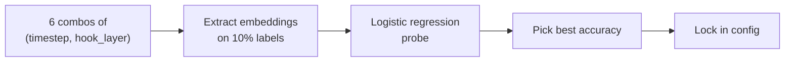
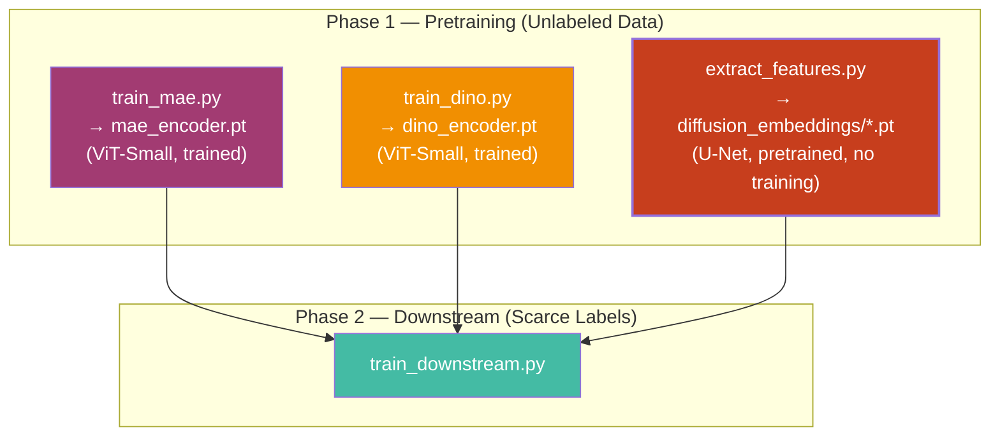

# Diffusion Pipeline — Full Breakdown

Your diffusion pipeline is fundamentally different from MAE and DINO. There's **no training**. You're using a pretrained denoising network as a frozen feature extractor. Here's every piece of it, chunk by chunk.

---

## Chunk 1: The Core Idea — Why Diffusion Models Have Good Features

A diffusion model (DDPM) is trained to **remove noise** from images. To do this well, it must learn rich internal representations — edges, textures, object parts, spatial layout. The insight from [Baranchuk et al. (ICLR 2022)](https://arxiv.org/abs/2112.03126) and [Kwon et al. (ICLR 2023)](https://arxiv.org/abs/2210.10960) is:

> You don't need to *run* the full denoising process. Just **add noise to an image, pass it through the denoising U-Net once, and grab the intermediate activations**. Those activations are already a powerful image representation.

Your pipeline does exactly this — zero training, just a single forward pass through a pretrained U-Net.

---

## Chunk 2: The Pretrained Model — `google/ddpm-cifar10-32`

| Property | Value |
|----------|-------|
| **Architecture** | U-Net (UNet2DModel from HuggingFace `diffusers`) |
| **Trained on** | CIFAR-10 (50K images, 32×32) |
| **Resolution** | 32×32 |
| **Why this model?** | CIFAR-10's 10 classes overlap with STL-10's 10 classes (airplane, bird, car, cat, deer, dog, horse, monkey, ship, truck) |
| **Downloaded from** | HuggingFace Hub at runtime (not saved locally) |

> [!NOTE]
> STL-10 images are 96×96, but they get **bicubic-resized to 32×32** before being fed to this U-Net. You trade resolution for a fast, compatible model.

---

## Chunk 3: The Forward Pass — Step by Step

Here's what happens inside [DiffusionEncoder.encode()](file:///c:/Users/abdul/Research/encoders/diffusion.py#L127-L156) when you feed it a batch of STL-10 images:

### Step 3a: Undo STL-10 Normalization → Diffusion Space

```
Input: x — shape (B, 3, 96, 96), STL-10 normalized (mean-subtracted, std-divided)

x_01 = x * std + mean        →  [0, 1] range
x_11 = x_01 * 2.0 - 1.0      →  [-1, 1] range (what DDPMs expect)
```

### Step 3b: Resize to Model Resolution

```
x_model = bicubic_resize(x_11)   →  (B, 3, 32, 32)
```

### Step 3c: Forward Diffusion — Add Noise

This is the **key step** that makes the whole thing work. You're simulating what the DDPM was trained to undo:

```python
noise     = torch.randn_like(x_model)          # random Gaussian noise
timesteps = torch.full((B,), t)                 # e.g., t=250 for all images
x_noisy   = scheduler.add_noise(x_model, noise, timesteps)
```

The DDPM scheduler uses the formula:

```
x_noisy = √(ᾱ_t) · x_clean  +  √(1 - ᾱ_t) · noise
```

Where `ᾱ_t` is the cumulative noise schedule. At `t=250` (out of 1000 total timesteps), the image is **moderately noisy** — enough structure remains for the U-Net to "see" the content, but enough noise that the U-Net must activate its semantic understanding.

> [!IMPORTANT]
> **The timestep `t` is the most important hyperparameter.** Too low (t=10): image is nearly clean, U-Net barely activates meaningful features. Too high (t=900): image is nearly pure noise, U-Net can't recover any semantics. Your sweep tests `t ∈ {100, 250, 500}` to find the sweet spot.

### Step 3d: Single U-Net Forward Pass

```python
self.unet(x_noisy, timesteps)    # hook fires internally, captures activation
```

The U-Net processes the noisy image **once**. No iterative denoising, no sampling loop. During this single forward pass, a **registered hook** captures the intermediate activation from a specific layer.

### Step 3e: Spatial Average Pooling → Embedding

```python
feat = self._activation["feat"]   # shape: (B, 256, 4, 4) for mid_block
embedding = feat.mean(dim=[2, 3]) # shape: (B, 256) — your feature vector
```

The hooked layer outputs a spatial feature map (like a small 4×4 grid with 256 channels). Averaging over the spatial dimensions collapses it into a single 256-dimensional vector per image.

---

## Chunk 4: The Hook Mechanism

Defined in [DiffusionEncoder._register_hook()](file:///c:/Users/abdul/Research/encoders/diffusion.py#L93-L102):

```python
def hook_fn(module, input, output):
    feat = output[0] if isinstance(output, tuple) else output
    act["feat"] = feat.detach()

module = self._get_submodule(hook_layer)  # e.g., "mid_block" or "down_blocks.2"
module.register_forward_hook(hook_fn)
```

**What this does:** PyTorch's hook system lets you intercept the output of any layer during a forward pass without modifying the model. The hook:
1. Fires automatically when that layer computes its output
2. Stores the activation tensor in a dictionary
3. The `encode()` method reads it after the forward pass completes

**Which layers are candidates?**

| Hook layer | Where in U-Net | Feature map shape | Embed dim |
|------------|---------------|-------------------|-----------|
| `mid_block` | Bottleneck (deepest) | `(B, 256, 4, 4)` | 256 |
| `down_blocks.2` | Late downsampling | `(B, 256, 4, 4)` | 256 |

> [!TIP]
> **Deeper layers = more semantic, more abstract.** `mid_block` is the deepest point of the U-Net — it's where the model has the most compressed, high-level representation. `down_blocks.2` is slightly earlier and may retain more spatial detail.

---

## Chunk 5: Calibration — Auto-detecting `embed_dim`

In [DiffusionEncoder._calibrate()](file:///c:/Users/abdul/Research/encoders/diffusion.py#L106-L116):

```python
dummy = torch.zeros(1, 3, 32, 32)   # fake image
self.unet(dummy, timestep=250)        # fire the hook
self._embed_dim = self._activation["feat"].shape[1]  # channel dim = 256
```

This runs once at initialization. It sends a dummy image through to discover the actual channel dimension of the hooked layer, rather than hardcoding it. This way, if you switch to `"google/ddpm-celebahq-256"` or hook a different layer, it still works.

---

## Chunk 6: The Hyperparameter Sweep — [extract_features.py](file:///c:/Users/abdul/Research/extract_features.py)

Before locking in the diffusion encoder, you run a grid search:

```
timesteps:   [100, 250, 500]
hook_layers: ["mid_block", "down_blocks.2"]
─────────────────────────────────────
Total combos: 3 × 2 = 6 configurations
```

For each combo:
1. Build a `DiffusionEncoder` with that `(timestep, hook_layer)`
2. Extract embeddings for 10% of labeled STL-10 (500 images)
3. Extract embeddings for full test set (8000 images)
4. Fit a **scikit-learn LogisticRegression** on the embeddings
5. Record test accuracy

The combo with the highest accuracy wins. This is a fast, lightweight validation — no neural network training needed.



---

## Chunk 7: Caching Embeddings for Downstream Use

After the best `(timestep, hook_layer)` is found, [extract_and_cache()](file:///c:/Users/abdul/Research/extract_features.py#L123-L160) runs the winning encoder over **all** STL-10 splits and saves the results:

| Split | Images | Saved to | Approx size |
|-------|--------|----------|-------------|
| `train` | 5,000 | `results/checkpoints/diffusion_embeddings/train.pt` | ~200 MB |
| `test` | 8,000 | `results/checkpoints/diffusion_embeddings/test.pt` | ~50 MB |
| `unlabeled` | 100,000 | `results/checkpoints/diffusion_embeddings/unlabeled.pt` | ~600 MB |

Each `.pt` file contains `{"embeddings": Tensor(N, 256), "labels": Tensor(N)}`.

> [!IMPORTANT]
> **Why cache?** The U-Net forward pass is expensive. During downstream training (Phase 2), the diffusion encoder is frozen anyway — the embeddings never change. So rather than running the U-Net every epoch, you precompute once and load from disk. This is why `train_downstream.py` uses a `_DiffusionCacheEncoder` that reads from these cached files instead of running the U-Net live.

---

## Chunk 8: How It Fits Into the Bigger Pipeline



In Phase 2, the diffusion embeddings participate in:
- **Config 3** — Diffusion standalone (linear probe on 256-d embeddings)
- **Config 5** — MAE + Diffusion fusion
- **Config 6** — DINO + Diffusion fusion
- **Config 7** — MAE + DINO + Diffusion trio fusion

---

## Chunk 9: Summary — The Complete Diffusion Data Flow

```
STL-10 image (96×96)
    │
    ├── Undo STL-10 norm → [0,1] → [-1,1]
    ├── Bicubic resize → (3, 32, 32)
    ├── Add Gaussian noise at timestep t
    │       x_noisy = √ᾱ_t · x_clean + √(1-ᾱ_t) · ε
    │
    ▼
Pretrained DDPM U-Net (frozen, single forward pass)
    │
    ├── Hook fires at "mid_block"
    │       ↓
    │   Activation: (B, 256, 4, 4)
    │       ↓
    │   Spatial avg pool: (B, 256)
    │
    ▼
256-dim embedding vector (per image)
    │
    ├── Cached to disk (train.pt, test.pt, unlabeled.pt)
    │
    ▼
Used in downstream linear probes / fusion
```

> [!TIP]
> **Key contrast with MAE and DINO:** Those methods *train* a ViT-Small encoder on your unlabeled data (learning custom representations for STL-10). Diffusion *borrows* a model already trained on CIFAR-10 and repurposes its internal features. This is what makes it interesting for your research question — it's a fundamentally different kind of representation (pixel-level denoising vs. patch reconstruction vs. self-distillation).
