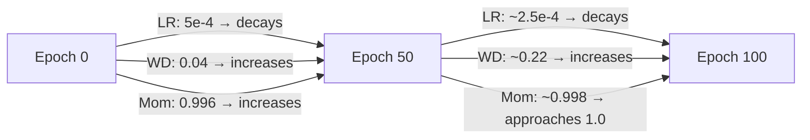
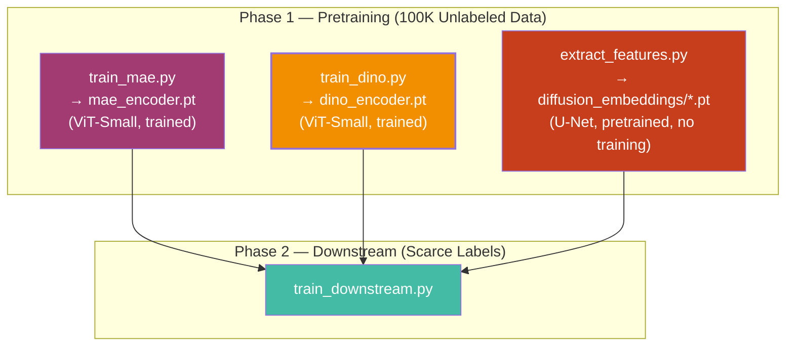

# DINO Pipeline — Full Breakdown

Your DINO pipeline is a **self-supervised pretraining method**. Unlike the diffusion encoder (which borrows a pretrained model), DINO *trains* a ViT-Small from scratch on your 100K unlabeled STL-10 images using **self-distillation** — the network learns by teaching itself. Here's every piece of it, chunk by chunk.

---

## Chunk 1: The Core Idea — Self-Distillation Without Labels

DINO (**Di**stillation with **No** labels) comes from [Caron et al. (ICCV 2021)](https://arxiv.org/abs/2104.14294). The key insight:

> If you show a student network a **cropped piece** of an image and a teacher network a **different crop** of the **same image**, then train the student to match the teacher's output (the embeddings) — the student learns powerful visual features. No labels needed.

The trick is that the teacher isn't a separate model. It's an **exponential moving average (EMA)** of the student's own weights. So the network is literally **distilling knowledge from a smoothed version of itself**.

Why does this work? Because the teacher sees **global crops** (large context) while the student must also handle **local crops** (small patches). Forcing the student to match the teacher's global-context output from just a tiny local crop teaches it to understand **what** is in the image, not just **where** things are.

---

## Chunk 2: The Architecture — What Gets Trained

| Component | Architecture | Role |
|-----------|-------------|------|
| **Student encoder** | ViT-Small/16 (~22M params) | Trainable backbone — this is what you keep |
| **Teacher encoder** | ViT-Small/16 (identical copy) | EMA shadow — no gradients, updated by momentum |
| **Student head** | MLP projection → prototypes | Maps CLS token → 4096-d distribution |
| **Teacher head** | MLP projection → prototypes (copy) | Same architecture, also EMA-updated |

Defined in [DINOEncoder](file:///c:/Users/abdul/Research/encoders/dino.py#L25-L84):

```
ViT-Small/16 specs:
  d_model   = 512     (embedding dimension)
  depth     = 8       (transformer blocks)
  num_heads = 8       (attention heads)
  mlp_dim   = 2048    (FFN hidden dimension)
  patch_size = 16     (96×96 image → 36 patches)
```

> [!IMPORTANT]
> **After pretraining, the teacher and both heads are discarded.** You only keep the student encoder. Its `encode(x)` method returns the CLS token embedding — a 512-dimensional vector per image. This is what feeds into the downstream linear probe.

---

## Chunk 3: The ViT Encoder — Step by Step

Here's what happens inside [DINOEncoder.encode()](file:///c:/Users/abdul/Research/encoders/dino.py#L75-L84) for a single crop:

### Step 3a: Patch Embedding

```
Input: x — shape (B, 3, 96, 96)

Conv2d(3, 512, kernel_size=16, stride=16)
  → (B, 512, 6, 6)     # 6×6 grid of patches
  → flatten + transpose
  → (B, 36, 512)        # 36 patch tokens, each 512-d
```

Each 16×16 pixel patch gets linearly projected into a 512-dimensional token. This is implemented in [PatchEmbedding](file:///c:/Users/abdul/Research/models/vit.py#L31-L48) — a single Conv2d does the slicing and projection in one step.

### Step 3b: Prepend CLS Token + Add Positional Embeddings

```
cls_token  : (1, 1, 512)  → expand to (B, 1, 512)
concat     : (B, 36, 512) + (B, 1, 512)  → (B, 37, 512)
pos_embed  : (1, 37, 512)  → add to all tokens
```

The **CLS token** is a learnable vector prepended to the sequence. After the transformer processes everything, this single token summarizes the entire image. The positional embeddings are also learnable — they tell the transformer where each patch came from spatially.

### Step 3c: Transformer Encoder (8 blocks)

```
for each of 8 TransformerBlocks:
    x = x + MHSA(LayerNorm(x))     # multi-head self-attention + residual
    x = x + MLP(LayerNorm(x))      # feed-forward network + residual
```

Each [TransformerBlock](file:///c:/Users/abdul/Research/models/vit.py#L97-L110) applies pre-norm attention and an MLP. After 8 blocks, every token has attended to every other token — the CLS token now "knows" about all 36 patches.

### Step 3d: Extract CLS Token

```
output = LayerNorm(x)[:, 0]    →  (B, 512)
```

Just take position 0 (the CLS token) from the final sequence. This 512-d vector is the image representation.

---

## Chunk 4: Multi-Crop Augmentation — The Engine of DINO

This is what makes DINO special. Defined in [get_multicrop_transform()](file:///c:/Users/abdul/Research/encoders/dino.py#L211-L258):

### The Crops

| Crop type | Count | Scale range | What it captures |
|-----------|-------|-------------|-----------------|
| **Global** | 2 | 0.4 – 1.0 of the image | Large context — most or all of the object |
| **Local** | 6 | 0.05 – 0.4 of the image | Tiny patches — a wing, a wheel, an ear |

**All crops are resized to 96×96** so the ViT's fixed positional embeddings stay valid.

### The Augmentation Stack

```
Global crops:
  RandomResizedCrop(96, scale=(0.4, 1.0))
  RandomHorizontalFlip(p=0.5)
  ColorJitter(brightness=0.4, contrast=0.4, saturation=0.2, hue=0.1)  — p=0.8
  RandomGrayscale(p=0.2)
  GaussianBlur(sigma=(0.1, 2.0))  — p=1.0 (always applied)
  Normalize(STL-10 mean/std)

Local crops:
  RandomResizedCrop(96, scale=(0.05, 0.4))
  Same augmentations, but GaussianBlur only p=0.5
```

> [!NOTE]
> **Why the asymmetry?** Global crops always get Gaussian blur (p=1.0), local crops sometimes get it (p=0.5). The original DINO paper found this asymmetry improves feature quality — it gives the teacher (which only sees globals) a different "style" from the student.

### The Data Flow

The [MultiCropTransform](file:///c:/Users/abdul/Research/encoders/dino.py#L198-L208) callable produces all 8 crops from a single image:

```python
def __call__(self, img):
    return (
        [self.g_t(img), self.g_t(img)]                      # 2 global crops
        + [self.l_t(img) for _ in range(self.n_loc)]        # 6 local crops
    )
```

The custom [_dino_collate](file:///c:/Users/abdul/Research/data/stl10_data.py#L166-L169) function then stacks these per-crop across the batch:

```
Input:  B samples, each a list of 8 crops
Output: list of 8 tensors, each shape (B, 3, 96, 96)
```

---

## Chunk 5: The Training Loop — Student vs. Teacher

Here's the core loop from [train()](file:///c:/Users/abdul/Research/train_dino.py#L33-L186), broken down:

### Step 5a: Student Processes ALL 8 Crops

```python
all_crops_cat = torch.cat(crops, dim=0)        # (B×8, 3, 96, 96)
student_out   = student_head(student.encode(all_crops_cat))
                                                # (B×8, 4096)
```

The student sees everything — both global and local crops. All 8 crops from each image are concatenated into one giant batch and processed in a single forward pass.

### Step 5b: Teacher Processes Only 2 Global Crops

```python
with torch.no_grad():
    teacher_out = teacher_head(teacher.encode(torch.cat(crops[:2], dim=0)))
                                                # (B×2, 4096)
```

The teacher only gets the two global crops — the "big picture" views. No gradients flow through the teacher; it's updated only via EMA.

### Step 5c: Compute DINO Loss

```python
loss = criterion(student_out, teacher_out, epoch)
```

This is the cross-entropy between teacher and student distributions (explained in Chunk 6).

### Step 5d: Backprop + Gradient Clipping

```python
loss.backward()
clip_grad_norm_(student_params + head_params, max_norm=3.0)
```

### Step 5e: Freeze Last Layer (First Epoch Only)

```python
if epoch < freeze_last_layer:
    student_head.last_layer.parametrizations.weight.original0.grad = None
```

> [!TIP]
> **Why freeze the last layer?** The prototype layer (last layer of the head) uses weight normalization. In the very first epoch, when the rest of the network is random, the prototype layer would receive extremely noisy gradients and could collapse. Zeroing its gradient for the first epoch lets the earlier layers stabilize first.

### Step 5f: EMA Teacher Update

```python
momentum = mom_schedule[global_step]     # 0.996 → 1.0 (cosine)
update_teacher(student, teacher, momentum)
update_teacher(student_head, teacher_head, momentum)
```

Defined in [update_teacher()](file:///c:/Users/abdul/Research/encoders/dino.py#L263-L267):

```
teacher_param ← momentum · teacher_param + (1 − momentum) · student_param
```

At the start (`m=0.996`), the teacher updates 0.4% toward the student each step. By the end (`m≈1.0`), the teacher barely moves — it becomes a very stable, smoothed reference.

---

## Chunk 6: The DINO Loss — How Self-Distillation Works

Defined in [DINOLoss](file:///c:/Users/abdul/Research/encoders/dino.py#L128-L187). This is the heart of the method.

### The Setup

Both student and teacher produce **probability distributions** over 4096 "prototypes" (think of them as soft pseudo-classes):

```
Teacher: softmax((output − center) / τ_teacher)    →  sharp distribution
Student: log_softmax(output / τ_student)            →  softer distribution
```

| Temperature | Value | Effect |
|-------------|-------|--------|
| `τ_teacher` | 0.04 → 0.07 (warmup over 30 epochs) | **Low** → sharp, peaked distribution |
| `τ_student` | 0.1 (fixed) | **Higher** → smoother distribution |

### The Cross-Entropy

For every pair `(teacher_crop_i, student_crop_j)` where `i ≠ j`:

```
loss += −Σ_k  teacher_prob[k] · log(student_prob[k])
```

This is standard cross-entropy — the student is trained to match the teacher's output distribution.

### Which Pairs?

```
Teacher crops: [global_0, global_1]          → 2 views
Student crops: [global_0, global_1, local_0, ..., local_5]  → 8 views

Valid pairs (teacher_i, student_j) where i ≠ j:
  (global_0, global_1)  ✓    (global_0, local_0..5)  ✓   → 7 pairs
  (global_1, global_0)  ✓    (global_1, local_0..5)  ✓   → 7 pairs
  ─────────────────────────────────────────────────────────
  Total: 14 pairs per image, averaged
```

> [!IMPORTANT]
> **The key asymmetry:** The teacher only sees global crops (big context), but the student must match the teacher's output even from tiny local crops. This forces the student to learn that a close-up of a cat's ear and a full cat image should produce the **same** representation. This is what creates semantic, object-level features.

### Centering — Preventing Collapse

Without any guard, all outputs could collapse to the same constant vector (trivially matching teacher and student). DINO prevents this with a **running center**:

```python
self.center = 0.9 · self.center + 0.1 · batch_mean(teacher_output)
teacher_softmax = softmax((teacher_out − self.center) / τ)
```

Subtracting the running mean ensures the teacher distribution can't degenerate into a single spike. This replaces the need for batch normalization or contrastive negatives (which other methods like MoCo/SimCLR rely on).

---

## Chunk 7: The DINO Head — Projection + Prototypes

Defined in [DINOHead](file:///c:/Users/abdul/Research/encoders/dino.py#L89-L123):

```
CLS token (512-d)
    │
    ├── Linear(512, 2048) + GELU
    ├── Linear(2048, 2048) + GELU      ← 3-layer MLP
    ├── Linear(2048, 256)              ← bottleneck
    │
    ├── L2 normalize
    │
    ├── WeightNorm(Linear(256, 4096))  ← prototype layer
    │
    ▼
4096-d output (fed to softmax for loss)
```

**Why this structure?**

1. The MLP projects the CLS embedding into a different space where the self-distillation loss operates
2. The **bottleneck** (256-d) prevents the head from being too expressive — it forces the encoder to do the heavy lifting
3. **L2 normalization** before the last layer ensures outputs live on a hypersphere (scale-invariant)
4. **Weight normalization** on the prototype layer decouples the direction and magnitude of prototype vectors, stabilizing training

> [!NOTE]
> **The head is discarded after pretraining.** It's only used to create the loss signal. The actual features you use downstream come from `encode()` (the CLS token before the head), not from the head's output.

---

## Chunk 8: The Schedules — Learning Rate, Weight Decay, Momentum

DINO uses three cosine schedules, all generated by [cosine_scheduler()](file:///c:/Users/abdul/Research/encoders/dino.py#L270-L274):

```python
# f(t) = end + 0.5 * (base - end) * (1 + cos(π * t / T))
```

| Schedule | Start → End | Total steps | Purpose |
|----------|-------------|-------------|---------|
| **Learning rate** | 5e-4 → 1e-6 | 100 epochs × steps_per_epoch | Standard cosine decay |
| **Weight decay** | 0.04 → 0.4 | Same | **Increasing** — more regularization as training progresses |
| **Teacher momentum** | 0.996 → 1.0 | Same | Teacher becomes increasingly stable |



> [!TIP]
> **Why does weight decay increase?** This is a DINO-specific trick. Early in training, you want the model to explore freely (low regularization). Later, you want it to consolidate and generalize (high regularization). The original paper found this schedule significantly improves downstream performance.

---

## Chunk 9: The Full Training Configuration

From [DEFAULT_CFG](file:///c:/Users/abdul/Research/train_dino.py#L191-L216) and [dino.yaml](file:///c:/Users/abdul/Research/configs/pretrain/dino.yaml):

| Parameter | Value | Why |
|-----------|-------|-----|
| `variant` | ViT-Small/16 | Matched to MAE for fair comparison |
| `img_size` | 96 | STL-10 native resolution |
| `patch_size` | 16 | 96/16 = 6 → 36 patches per image |
| `epochs` | 100 | Enough for convergence on 100K images |
| `batch_size` | 64 | × 8 crops = 512 effective images per step |
| `base_lr` | 5e-4 | AdamW with cosine decay |
| `out_dim` | 4096 | Number of prototypes (soft pseudo-classes) |
| `n_local_crops` | 6 | 2 global + 6 local = 8 total crops |
| `student_temp` | 0.1 | Softer student distribution |
| `teacher_temp` | 0.04 → 0.07 | Sharp teacher distribution (warmup over 30 epochs) |
| `teacher_momentum_start` | 0.996 | EMA momentum, cosine to 1.0 |
| `freeze_last_layer_epochs` | 1 | Stabilize prototype layer |
| `clip_grad` | 3.0 | Prevent gradient explosions |

> [!NOTE]
> **Effective batch size is large.** With `batch_size=64` and 8 crops, the student processes `64 × 8 = 512` image views per step. The teacher processes `64 × 2 = 128`. This is important for DINO — the centering mechanism needs enough samples per batch to estimate a stable running mean.

---

## Chunk 10: What Gets Saved

After training completes:

| File | Contents | Size |
|------|----------|------|
| `results/checkpoints/dino_encoder.pt` | Final student encoder `state_dict()` | ~85 MB |
| `results/checkpoints/dino_encoder_best.pt` | Best loss student encoder | ~85 MB |
| `results/checkpoints/dino_training_log.json` | Loss history + config | ~10 KB |

**Discarded after training:** Teacher encoder, student head, teacher head, DINOLoss center buffer. These served their purpose during training — only the student backbone matters.

---

## Chunk 11: How It Fits Into the Bigger Pipeline



In Phase 2, the DINO encoder participates in:
- **Config 2** — DINO standalone (linear probe on 512-d CLS embeddings)
- **Config 4** — MAE + DINO fusion
- **Config 6** — DINO + Diffusion fusion
- **Config 7** — MAE + DINO + Diffusion trio fusion

---

## Chunk 12: Summary — The Complete DINO Data Flow

```
STL-10 unlabeled image (96×96)
    │
    ├── MultiCropTransform
    │       ├── 2 global crops (scale 0.4–1.0, resized to 96×96)
    │       └── 6 local crops  (scale 0.05–0.4, resized to 96×96)
    │
    ▼
┌─────────────────────────────────────────────────────┐
│  Student (trainable)              Teacher (EMA)     │
│  ────────────────────             ──────────────    │
│  Sees: all 8 crops               Sees: 2 globals   │
│  ViT-Small → CLS (512-d)         ViT-Small → CLS   │
│  DINOHead → 4096-d               DINOHead → 4096-d │
│  softmax(z / 0.1)                softmax((z−c) / τ)│
│                                                     │
│              cross-entropy loss                     │
│     student matches teacher across crop pairs       │
│              (14 pairs, i ≠ j)                      │
│                                                     │
│  backprop → student + head       EMA update ← student│
│  (centering prevents collapse)                      │
└─────────────────────────────────────────────────────┘
    │
    │ After 100 epochs:
    │
    ▼
Student encoder (frozen)
    │
    ├── encode(x) → CLS token → (B, 512)
    │
    ▼
512-dim embedding vector (per image)
    │
    ▼
Used in downstream linear probes / fusion
```

> [!TIP]
> **Key contrast with MAE and Diffusion:** MAE learns by **reconstructing missing pixels** — it masks 75% of patches and rebuilds them (pixel-level task). DINO learns by **matching distributions across crops** — it never reconstructs anything, just ensures local and global views produce the same representation (semantic-level task). Diffusion **borrows** a model trained on noise removal (CIFAR-10 U-Net) and repurposes its internal features. These three fundamentally different learning signals are exactly why fusing them is your core research question.
