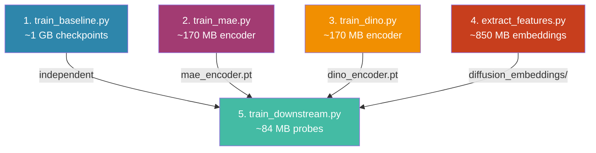

# Distributing Training: GitHub vs Google Drive

## TL;DR Recommendation

> [!IMPORTANT]
> **Use both — GitHub for code, Google Drive for checkpoints/embeddings.** This is the standard research workflow and the one your project is already set up for (your `.gitignore` excludes all `.pt/.pth` files).

---

## What Each Script Produces

Here's a complete breakdown of every file generated at each step:

### Step 1 — `train_baseline.py` (no dependencies)

| Output | Path | Type | Size |
|--------|------|------|------|
| Checkpoint | `results/runs/baseline/<frac>/<seed>/checkpoint.pt` | Binary (`.pt`) | ~85 MB |
| Config snapshot | `results/runs/baseline/<frac>/<seed>/config.yaml` | Text | ~1 KB |
| Metrics + history | `results/runs/baseline/<frac>/<seed>/metrics.json` | Text | ~50 KB |
| Training curves | `results/plots/baseline/<frac>_<seed>_training_curves.png` | Image | ~100 KB |
| Confusion matrix | `results/plots/baseline/<frac>_<seed>_confusion_matrix.png` | Image | ~50 KB |
| Sample predictions | `results/plots/baseline/<frac>_<seed>_sample_predictions.png` | Image | ~200 KB |

> Runs across **4 fractions × 3 seeds = 12 runs**. That's 12 checkpoints (~1 GB total).

---

### Step 2 — `train_mae.py` (no dependencies, parallelizable with 1)

| Output | Path | Type | Size |
|--------|------|------|------|
| Best encoder | `results/checkpoints/mae_encoder_best.pt` | Binary | ~85 MB |
| Final encoder | `results/checkpoints/mae_encoder.pt` | Binary | ~85 MB |
| Training log | `results/checkpoints/mae_training_log.json` | Text | ~20 KB |

> **Single run** (200 epochs on unlabeled data). Only encoder weights saved, decoder is discarded.

---

### Step 3 — `train_dino.py` (no dependencies, parallelizable with 1, 2)

| Output | Path | Type | Size |
|--------|------|------|------|
| Best student encoder | `results/checkpoints/dino_encoder_best.pt` | Binary | ~85 MB |
| Final student encoder | `results/checkpoints/dino_encoder.pt` | Binary | ~85 MB |
| Training log | `results/checkpoints/dino_training_log.json` | Text | ~10 KB |

> **Single run** (100 epochs on unlabeled data). Teacher and projection heads are discarded.

---

### Step 4 — `extract_features.py` (no dependencies, parallelizable with 1, 2, 3)

| Output | Path | Type | Size |
|--------|------|------|------|
| Best config | `results/checkpoints/diffusion_best_config.yaml` | Text | ~1 KB |
| Sweep results | `results/checkpoints/diffusion_sweep_results.json` | Text | ~2 KB |
| Train embeddings | `results/checkpoints/diffusion_embeddings/train.pt` | Binary | ~200 MB |
| Test embeddings | `results/checkpoints/diffusion_embeddings/test.pt` | Binary | ~50 MB |
| Unlabeled embeddings | `results/checkpoints/diffusion_embeddings/unlabeled.pt` | Binary | ~600 MB |

> [!WARNING]
> The diffusion embeddings are **the largest outputs** (~850 MB total). The U-Net model itself is downloaded from HuggingFace (`google/ddpm-cifar10-32`) at runtime — it is not saved locally.

---

### Step 5 — `train_downstream.py` (needs outputs from 2, 3, 4)

| Output | Path | Type | Size |
|--------|------|------|------|
| Config snapshot | `results/runs/<config_name>/<frac>/<seed>/config.yaml` | Text | ~1 KB |
| Metrics | `results/runs/<config_name>/<frac>/<seed>/metrics.json` | Text | ~20 KB |
| Probe checkpoint | `results/runs/<config_name>/<frac>/<seed>/checkpoint.pt` | Binary | ~1 MB |

> Runs across **7 configs × 4 fractions × 3 seeds = 84 runs**. Checkpoints are small (linear heads only).

---

### Also generated by `run_sweep.py` (summary phase)

| Output | Path | Type |
|--------|------|------|
| Summary CSV | `results/summary.csv` | Text |
| Label efficiency plot | `results/plots/label_efficiency_curves.png` | Image |
| Fusion comparison bar | `results/plots/fusion_comparison_bar.png` | Image |
| CKA heatmap | `results/plots/cka_heatmap.png` | Image |

---

## Size Summary

| Category | Approx. Total Size |
|----------|-------------------|
| MAE encoder checkpoints | ~170 MB |
| DINO encoder checkpoints | ~170 MB |
| Diffusion embeddings | ~850 MB |
| Baseline checkpoints (12 runs) | ~1 GB |
| Downstream probe checkpoints (84 runs) | ~84 MB |
| Plots, configs, metrics (text/images) | ~10 MB |
| **Grand Total** | **~2.3 GB** |

---

## GitHub vs Google Drive — The Comparison

| Factor | GitHub (Fork) | Google Drive |
|--------|---------------|--------------|
| **Code versioning** | ✅ Built for this | ❌ No diff/merge/history |
| **Binary files (`.pt`)** | ❌ GitHub limits: 100 MB per file, 1 GB repo soft limit | ✅ 15 GB free, unlimited with uni accounts |
| **Collaboration on code** | ✅ PRs, branches, code review | ❌ Not practical |
| **Sharing checkpoints** | ❌ Terrible — bloats repo, can't `.gitignore` and still share | ✅ Simple link sharing |
| **Reproducibility** | ✅ Exact code pinned per commit | ⚠️ Need to manually match code version to Drive files |
| **Sync overhead** | Low (text files only) | Low (drag and drop / rclone) |
| **Already configured** | ✅ Your `.gitignore` already excludes `*.pt`, `*.pth`, `results/runs/` | — |

---

## Recommended Workflow

### What goes in **GitHub** (code changes only)
```
✅ *.py files (any code edits)
✅ configs/**/*.yaml
✅ results/plots/*.png          (small, useful to version)
✅ results/summary.csv          (tiny, useful to version)
✅ .gitignore, pyproject.toml
✅ README.md, run_order.txt
```

### What goes in **Google Drive** (training outputs)
```
📁 Drive/Research-Checkpoints/
├── mae_encoder.pt              ← from step 2
├── mae_encoder_best.pt
├── mae_training_log.json
├── dino_encoder.pt             ← from step 3
├── dino_encoder_best.pt
├── dino_training_log.json
├── diffusion_best_config.yaml  ← from step 4
├── diffusion_sweep_results.json
├── diffusion_embeddings/       ← from step 4 (biggest files)
│   ├── train.pt
│   ├── test.pt
│   └── unlabeled.pt
└── runs/                       ← from steps 1 & 5
    ├── baseline/...
    ├── standalone/...
    └── fusion/...
```

### Practical Distribution Strategy

Say Person A runs steps 1+2, Person B runs step 3, Person C runs step 4:

1. Everyone clones/forks the **same GitHub repo**
2. Each person runs their assigned step(s) on their machine (with GPU)
3. After training completes, they upload their `results/checkpoints/` outputs to a **shared Google Drive folder**
4. Before running **Step 5** (downstream), the runner downloads all checkpoints from Drive into their local `results/checkpoints/`
5. Step 5 runs, results get uploaded back to Drive
6. Any **code changes** get pushed to GitHub via PR/branch

> [!TIP]
> You can automate the Drive sync with `rclone` or `gdown`:
> ```bash
> # Download all checkpoints before step 5
> gdown --folder <drive-folder-id> -O results/checkpoints/
> ```

---

## The Dependency Graph (Visual)



**Steps 1–4 are fully parallelizable.** Step 5 only needs the outputs from 2, 3, and 4.
