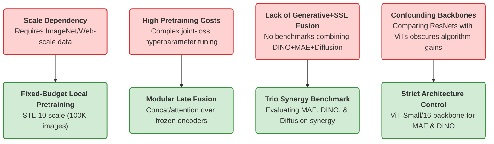

# Literature Review: Similar Works & Addressing Existing Limitations

This document analyzes existing academic literature related to self-supervised learning (SSL) fusion and diffusion-based feature extraction. It maps how our research questions and pipeline design contrast with, and address the limitations of, existing state-of-the-art solutions.

---

## 1. Landscape of Similar Works

Our project lives at the intersection of three research directions: **Contrastive/Distillation-based SSL (DINO)**, **Masked Image Reconstruction (MAE)**, and **Diffusion-based feature extraction (DDPM)**. Below is a taxonomy of the most closely related academic works.

### A. Hybrid Pretraining (Joint MAE + DINO Architectures)
Several works have recognized that contrastive/distillation methods and masked reconstructive methods learn complementary features:
*   **MR-MAE (Masked Representation Mimicking, 2022/2023):** Combines MAE with a teacher model (often CLIP or DINO). During pretraining, the student ViT must not only reconstruct masked pixels but also predict the high-level semantic representation of the teacher.
*   **MAE-DINO (and similar hybrid frameworks):** Integrates both DINO’s global consistency loss (which forces matching distributions across different crops) and MAE's local patch reconstruction loss into a single joint objective.
*   *Key difference:* These methods combine the objectives **during** the pretraining stage, creating a unified model weight.

### B. Late Fusion & Multi-Encoder Ensembles
Fusing representations from multiple independent pretrained models at the feature level:
*   **Fusing Foundation Models (e.g., CLIP + DINOv2):** Recent papers investigate using features from CLIP (contrastive text-image) and DINOv2 (self-supervised vision) together for downstream dense prediction tasks (like object detection and segmentation). They show that CLIP brings semantic categorization while DINOv2 brings high-resolution spatial layout.
*   *Key difference:* These ensembles typically use web-scale pretrained foundation models, whereas our study controls the pretraining budget and aligns the dataset.

### C. Diffusion Models as Feature Extractors
Repurposing generative diffusion models for discriminative tasks:
*   **Baranchuk et al. (ICLR 2022) / Kwon et al. (ICLR 2023):** Demonstrated that frozen intermediate activations of denoising U-Nets (such as DDPM or Stable Diffusion) contain rich semantic and spatial information. They extract these features by adding noise at a timestep $t$ and passing the image through the U-Net.
*   *Key difference:* These works evaluate diffusion features standalone (often for segmentation or classification), but rarely combine them with classical SSL representations like MAE and DINO.

---

## 2. Limitations of Existing Solutions

While the above works show high performance, they suffer from several fundamental limitations that our research addresses:

### 1. Scale Dependency & Resource Constraints
*   **Limitation:** The vast majority of SSL and foundation model research is evaluated on ImageNet-1k (1.28M images), ImageNet-21k (14M images), or proprietary web-scale datasets. They assume access to vast unlabeled pools. In many real-world domains (e.g., medical imaging, satellite imagery, industrial defect detection), such scale is impossible.
*   **How we address it:** We constrain our unlabeled pretraining pool to **exactly 100K images (STL-10 unlabeled split)**. We evaluate whether self-supervised pretraining is still highly sample-efficient and beneficial when constrained to a **small local budget**, rather than assuming web-scale data.

### 2. Extreme Compute and Instability of Joint Pretraining
*   **Limitation:** Jointly training a hybrid model (like training DINO and MAE objectives together) is notoriously expensive and unstable. The optimization objective requires balancing trade-offs between reconstruction loss and contrastive entropy, often leading to representation collapse or requiring complex, hyperparameter-sensitive schedules.
*   **How we address it:** We employ **modular late fusion** via a lightweight trainable head (`concat_proj` or `cross_attn`) over frozen encoders. MAE, DINO, and Diffusion are prepretrained independently (or borrowed, in the case of diffusion) and frozen. This drastically reduces computing costs and allows plug-and-play flexibility.

### 3. Missing Synergy Benchmarks
*   **Limitation:** Existing works occasionally study MAE + DINO, or DINO + CLIP, or Diffusion standalone. There is a lack of systematic evaluation checking if adding a generative denoising paradigm (Diffusion) to a masked generative paradigm (MAE) and a self-distillation paradigm (DINO) provides additional orthogonal representations that improve downstream data-scarce classification.
*   **How we address it:** We design an explicit 8-configuration matrix (ViT scratch baseline, standalone encoders, pairwise fusions, and the trio fusion) across multiple label-scarcity fractions ($1\%, 5\%, 10\%, 100\%$) and random seeds. This allows us to quantify exactly if and where the synergy of the three paradigms occurs.

### 4. Confounding Model Capacity & Inductive Biases
*   **Limitation:** Many comparative studies compare different SSL algorithms using different underlying architectures (e.g., comparing a ResNet-50 SimCLR with a ViT-Base MAE). This makes it impossible to tell if performance changes are due to the pretraining algorithm or the parameter size/inductive bias of the backbone.
*   **How we address it:** We control the architecture strictly by using a custom-implemented **ViT-Small/16** backbone (~22M parameters) for both the baseline classifier, the MAE encoder, and the DINO student encoder.

---

## 3. Detailed Comparison: Existing Work vs. Ours

| Dimension | Existing Joint Work (e.g., MR-MAE) | Existing Multi-Encoder Ensembles | Our Approach |
| :--- | :--- | :--- | :--- |
| **Fusion Type** | **Early/Mid Fusion** (Objectives are combined during pretraining). | **Late Fusion** (Features are combined downstream). | **Late Fusion** (Features are combined downstream). |
| **Pretraining Computations** | Extremely high (requires dual forward passes and joint loss calculation). | Moderate (uses pre-trained models off-the-shelf). | **Low to Moderate** (Encoders pre-trained once and frozen; only a small MLP fusion head is trained). |
| **Unlabeled Dataset Scale** | Typically ImageNet-1K/21K (1.3M to 14M images). | Web-scale foundation models (CLIP/DINOv2). | **Fixed, small local budget** (STL-10 unlabeled, 100K images). |
| **Paradigms Fused** | Contrastive/Distillation + Masked Reconstruction. | Text-Contrastive (CLIP) + Vision-Distillation (DINOv2). | **Masked Reconstruction (MAE) + Self-Distillation (DINO) + Denoising Score-Matching (Diffusion)**. |
| **Verification Gate** | Rarely verify representation overlap mathematically. | Often rely on downstream test metrics. | **Centered Kernel Alignment (CKA)** calculated on representation spaces before downstream evaluation. |

---

## 4. Why We Expect Fusion to Help: Complementary Inductive Biases

To understand why this trio fusion addresses the limits of standalone models, we look at the mathematical and visual representation style of each encoder:

### DINO: The "What" (Global Semantic Invariant)
DINO optimizes the cross-entropy of student and teacher output distributions over global and local crops. By forcing the student to map a small local crop (e.g., a wheel) to the teacher’s global context representation (e.g., a whole car), DINO learns **global semantics and shape boundaries**. 
*   *Representation style:* Homogeneous representation, highly semantic, excellent for linear separation of classes.
*   *Limitation:* Discards low-level textures, pixel configurations, and spatial relationships.

### MAE: The "Where" (Local Dense Reconstructor)
MAE masks 75% of the image patches and trains the encoder to help a lightweight decoder reconstruct the raw pixels. This forces the encoder to learn **local texture coherence, edges, and high-frequency details** so the decoder can fill in the missing parts.
*   *Representation style:* High spatial variance, retains detailed localized pixel structure.
*   *Limitation:* The representations are less linearly separable because the model focuses on reconstruction rather than classification boundary definition.

### Diffusion: The "How" (Multi-Scale Denoising Layout)
Diffusion U-Nets are trained to estimate the added noise at a specific scale. Denoising forces the network to understand the **underlying structure, spatial layout, and noise-invariant features** of the image. By capturing the intermediate bottleneck (`mid_block`), we extract features that represent structural templates.
*   *Representation style:* Structurally regularized, capturing spatial layouts and semantic outlines.
*   *Limitation:* Pretrained on CIFAR-10 (32x32) and may miss fine-grained, high-resolution details of STL-10 images.

> [!TIP]
> **Why Centered Kernel Alignment (CKA) is our gate:** 
> We compute the CKA between the representation matrices of MAE, DINO, and Diffusion before training our downstream head. A low CKA score ($<0.5$) mathematically validates that these three encoders indeed project the same STL-10 image into highly dissimilar manifolds, providing proof that the late fusion module has complementary information to exploit.
